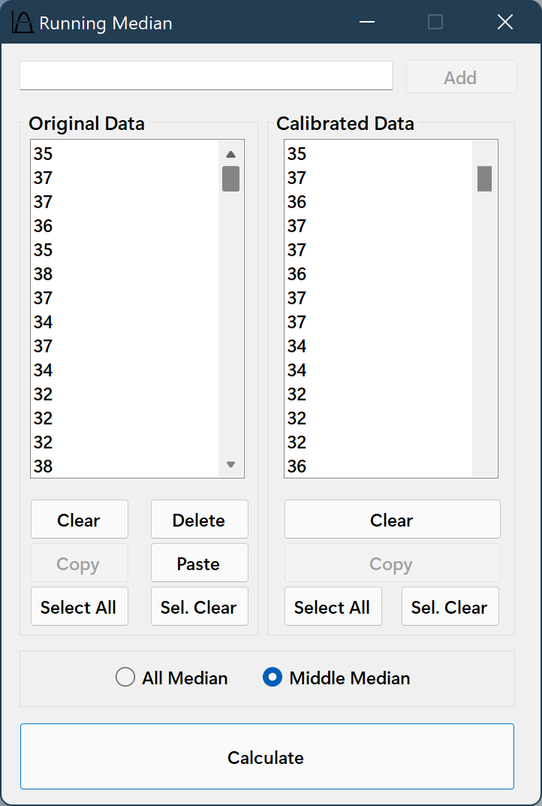

# RunningMedian
VB.NET project to determine the running median by means of data on the Listbox control.

## What's New

Click to Expand

### v1.0
#### February 16, 2022
> Initial release.

#### February 17, 2022
> Fixed several bugs.
> Hi-DPI monitors support.

## Features
- Copy and paste the necessary numeric data or drag and drop the data from the Microsoft Excel sheet or other spreadsheet software into the listbox.
- To calibrate and convert original data using the running median method, click on the [Calculate] button.
- Applied quick sort algorithm.
- Correcting for outliers in a running median.

## Demonstration

## Known Issues
- Results may not be accurate when you use less than the 5 numeric data samples.
